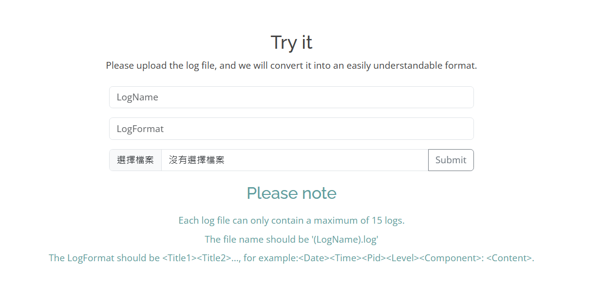
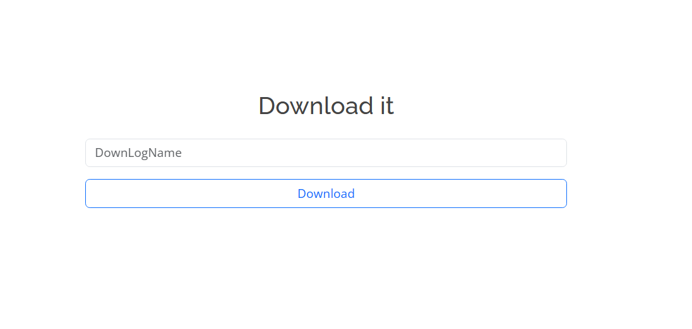

# README Template


> 使用 LLM 實作 Log Parser

## 功能要求達成程度

- [x] log format
- [x] parameter
- [ ] significant token

## 架構圖


## 使用介面圖

> 上傳 log 檔並輸入相對應欄位
> 
> 下載 structured log
> 

## 安裝

> 請務必依據你的專案來調整內容。

以下將會引導你如何安裝此專案到你的電腦上。

python 版本建議為：3.10.11 以上...

### 取得專案

```bash
git clone https://github.com/minniewei/LLM_Parser.git
```

### 安裝套件

```bash
pip install -r requirements.txt
```

### 開啟專案

在瀏覽器網址列輸入以下即可看到畫面

```bash
python app.py
```

```bash
http://localhost:5000/
```

## 資料夾說明

- app.py - 程式進入處 + flask 網頁架設處
- log.py - 定義每個 log 檔
- chatPDF.py - 跟 chatPDF api 進行溝通
- static - 靜態資源放置處
- templates - html 放置處
