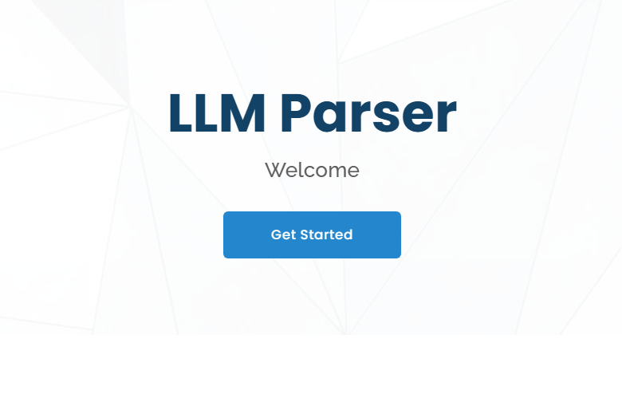
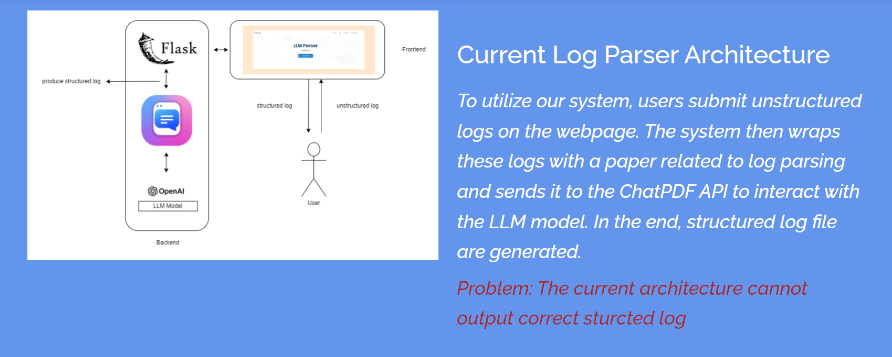
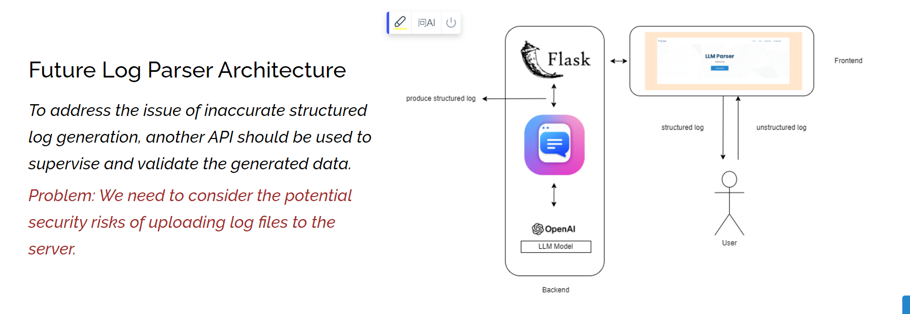
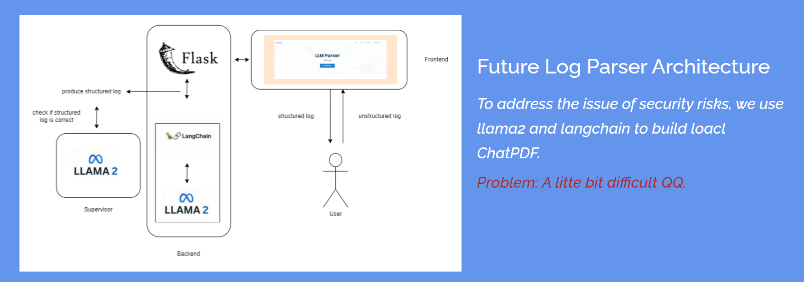

# README Template



> 使用 LLM 實作 Log Parser

## 功能

- [x] log format
- [x] parameter
- [ ] significant token

## 架構





## 安裝

> 請務必依據你的專案來調整內容。

以下將會引導你如何安裝此專案到你的電腦上。

python 版本建議為：`3.10.11ˋ 以上...

### 取得專案

```bash
git clone https://github.com/minniewei/LLM_Parser.git
```

### 安裝套件

```bash
pip install -r requirements.txt
```

### 開啟專案

在瀏覽器網址列輸入以下即可看到畫面

```bash
http://localhost:5000/
```

## 資料夾說明

- views - 畫面放置處
- controllers - 控制器放置處
- modules - 模組放置處
- assets - 靜態資源放置處

  - scss - scss 檔案放置處
  - images - 圖片放置處
    ...
